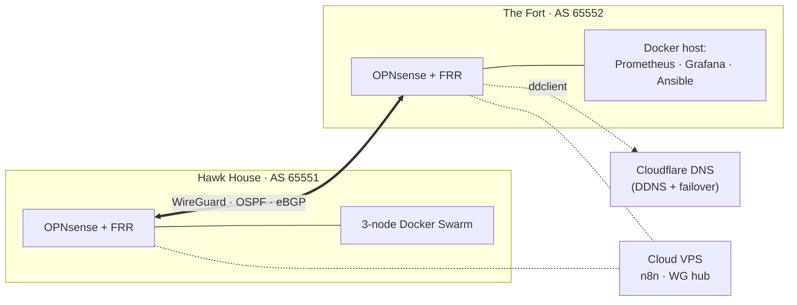

# Two-Site Home Lab: Routing, Monitoring & Automation

A production-style home network across two physical sites. Each site has an
OPNsense edge running FRR, and the sites are joined by WireGuard with OSPF and
eBGP on top. The lab is monitored end to end with Prometheus and Grafana, and
run with Ansible and n8n.

Every config in this repo was **captured from a running system** and then
sanitized (see [docs/SANITIZATION.md](docs/SANITIZATION.md)). Where the live
system has a flaw, the docs say so, along with what I'd do about it.

## At a glance

Full diagrams: [diagrams/topology.md](diagrams/topology.md)

| | Hawk House | The Fort |
|---|---|---|
| Role | Permanent site: critical services | Lab and compute site |
| Edge | OPNsense + FRR 10.7 | OPNsense + FRR 10.7 |
| WAN | Public IP on the firewall | Dynamic, double-NAT behind ISP ONT |
| Address block | 4 × /24 security zones | 4 × /24 security zones |
| Compute | 3-node Docker Swarm | General-purpose Docker host (macvlan per service) |

## What's in here

| Folder | What it shows |
|---|---|
| [`networking/`](networking/) | Addressing plan, WireGuard site-to-site, **OSPF over WireGuard (NBMA)**, **eBGP between loopbacks**, DDNS behind double NAT, live FRR configs, a DDNS incident write-up |
| [`monitoring/`](monitoring/) | Prometheus scrape design (~30 jobs / ~175 targets), alert rules, Grafana, VictoriaLogs, alert delivery to phone via self-hosted ntfy |
| [`automation/`](automation/) | Ansible fleet patching (audit → patch → staged reboots on systemd timers), Ansible-built Docker Swarm, Cloudflare DNS-failover watchdog, n8n workflows (AI job-application document generator, game-server update sweep) |
| [`diagrams/`](diagrams/) | Mermaid topology, routing control plane, WAN-change sequence |
| [`docs/`](docs/) | Sanitization map |
| [`scripts/`](scripts/) | `sanitize-check.sh`, the pre-commit leak scan this repo is held to |

## Skills demonstrated

| Area | Where to look |
|---|---|
| Dynamic routing: OSPF network types, passive interfaces, eBGP multihop, peer groups, prefix-lists and route-maps, dynamic neighbors | [networking/README.md](networking/README.md#routing-ospf-underlay-ebgp-between-loopbacks), [networking/frr/](networking/frr/) |
| Site-to-site VPN design: WireGuard cryptokey routing as a second policy layer, NAT keepalives, MTU | [networking/README.md](networking/README.md#inter-site-transport-wireguard) |
| Segmentation and addressing: per-site /22 split into zones, consistent `.100` gateways, split-horizon DNS | [networking/README.md](networking/README.md#addressing-plan) |
| Troubleshooting method: measure, find the second fault behind the first, record the wrong guess | [networking/ddns/README.md](networking/ddns/README.md) |
| Observability: exporter selection, blackbox from two vantage points, alerting that reaches a human | [monitoring/README.md](monitoring/README.md) |
| Infrastructure as code: Ansible roles, staged reboots, systemd timers, safe-by-default modes | [automation/README.md](automation/README.md) |
| Workflow automation and APIs: n8n with Notion, Google Drive and the Claude API | [automation/n8n/](automation/n8n/) |

## Known issues and roadmap

I'd rather show where the lab is imperfect than pretend it isn't:

- **BGP is established but carries no prefixes.** The outbound prefix-list and
  route-map have no overlap. OSPF currently does all the work. Next step: decide
  which protocol is authoritative, then fix the policy.
  [Details](networking/README.md#known-issues-found-while-writing-this-up)
- **OSPF `area range` / `filter-list` are inert** in a single-area design.
- **BFD is enabled with no peers**, so failover takes ~40 s on OSPF timers.
- **Fort's WAN address still appears as a literal** in the WireGuard peer and the
  DNS-failover config, so a WAN change needs a runbook rather than following DDNS.
- **Monitoring runs on one host**, by choice: I consolidated off the Swarm, and
  the README explains why. The single point of failure is acknowledged.

## About

Built and run by **Chance** ([@iamgadgetman](https://github.com/iamgadgetman)),
a network and security engineer with ~20 years across Cisco, Meraki,
Palo Alto, Juniper, SD-WAN and container platforms. This lab is where I try
designs before I'd recommend them.
