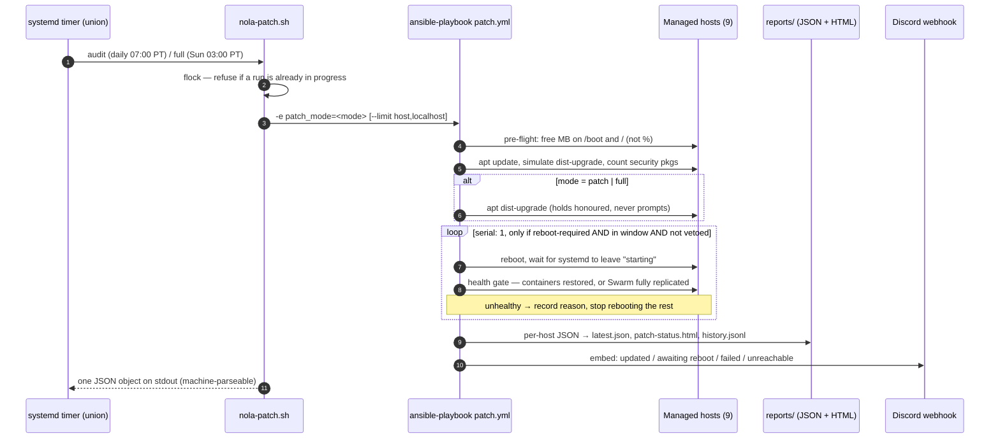
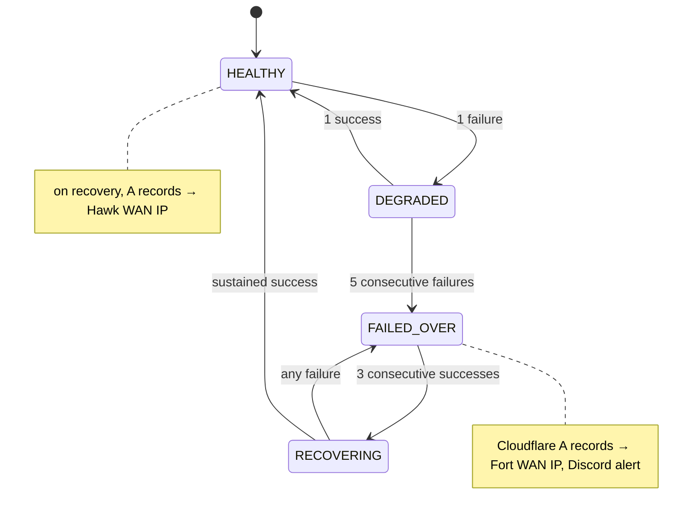

# Automation

I run a two-site homelab: **Hawk**, the permanent site with a three-node Docker
Swarm, and **Fort**, a secondary site with a general-purpose Docker host. On top of
that there is a cloud VPS. The automation here falls into three groups:

| What | Tooling | Runs from | Status |
|---|---|---|---|
| OS patching for the Linux fleet | **Ansible**, driven by systemd timers (plus a Semaphore UI for ad-hoc runs) | Fort control host (`union`) | Live, unattended since Aug 2026 |
| Swarm build + DNS failover | **Ansible** playbooks, Python watchdog as a Swarm service | Hawk Swarm (`eagle`) | Live |
| Game-server (AMP) update sweep | **n8n** scheduled workflow over SSH | VPS n8n | Live, monthly |
| Job-application document generator | **n8n** + Claude API + Google Docs/Drive + Notion | VPS n8n | Live, polls every 10 min |

Everything in this folder came from a running system and was then sanitized
using [`docs/SANITIZATION.md`](../docs/SANITIZATION.md). The IPs are remapped,
the domains are `example.net`, and every secret is a `<PLACEHOLDER>`.

```
automation/
├── ansible/
│   ├── patching/        # inventory, patch.yml, apt_patch + reboot_window roles,
│   │                    # nola-patch.sh entry point, systemd user units
│   └── swarm/           # 01-docker-swarm.yml, 06-dns-failover.yml + inventory
├── dns-failover/        # failover.py, config.yml, docker-stack.yml
└── n8n/                 # job-application-doc-generator.json, amp-update.json
```

---

## 1. Fleet patching with Ansible

**The problem.** I had nine Linux hosts spread over two sites, three timezones'
worth of clocks, a Proxmox hypervisor, a game server that drops players if it
reboots, and a Swarm cluster. I wanted all of them patched every week without
having to remember, and I wanted any failure to be loud.

**The design.** A single entry point, `bin/nola-patch.sh`, runs
`playbooks/patch.yml` in one of three modes. By default it runs the safest one:

| Mode | Effect |
|---|---|
| `audit` | Refresh indexes and list what *would* change (`apt-get --just-print`). Changes nothing. |
| `patch` | Apply upgrades (`dist-upgrade`, `force-confold`, `NEEDRESTART_MODE=a`). Never reboots. |
| `full`  | Apply upgrades and reboot the hosts that need it, one at a time, inside the maintenance window. |

What actually schedules it is a pair of **systemd user timers** on the control
host. A daily `audit` runs at 07:00 Pacific, and a weekly `full` runs Sunday at
03:00 Pacific. A Semaphore UI shares the same tree and the same `flock`, so it
can't overlap a timer run. The playbook posts its own Discord embed through
an Ansible `uri` task, and writes `latest.json`, an HTML report and a history
file. A read-only card on the lab dashboard reads those files.



### Design decisions

- **One clock for the window.** Some hosts run UTC and some run Pacific, so a
  host-local "Sunday 03:00" is two different moments. The role reads the time
  once, on the control host, in `maintenance_timezone`. That keeps the window
  and the timer's `OnCalendar` in agreement by construction.
- **Reboot vetoes are group membership.** The vetoes are not just variable
  precedence. A host in `no_auto_reboot` (the control host, the game server,
  the hypervisor) reports `needs_approval` and is never rebooted unattended.
- **A Swarm node is judged by the cluster.** After a reboot the Swarm scheduler
  doesn't move tasks back to the node, so counting containers on that node
  fails healthy hosts. On a Swarm node the gate is "no service is below its
  replica count" instead.
- **Failures still produce a report.** A health-check failure in a `serial: 1`
  play used to end the run before the reporting play, so the run you most
  needed a report from produced none. The assert is now inside a
  `block/rescue`. It records the reason, stops further reboots, and lets the
  report and the notification go out anyway.
- **Pre-flight measures free megabytes, not percent.** The old "85% full" rule
  refused a 1.9 TB disk that had 239 GB free, and it passed a 512 MB `/boot`
  that had 76 MB left.
- **Least privilege lives at the key.** Ansible `become` always runs
  `/bin/sh -c python3 …`, so a per-binary sudo allowlist can't work. Instead
  the access is tied to a dedicated `patchbot` key. The bootstrap script can
  pin that key to the control host with `from=` in `authorized_keys`, and
  `IdentitiesOnly=yes` stops a personal key from masking a host that was never
  bootstrapped.

**First fleet run (Aug 2026):** 9 of 9 hosts clean. 217 packages were installed,
54 of them security updates, and 5 hosts rebooted onto new kernels. That run
also caught a DNS-failover service that had been silently down for ten days.
Its cause was a Swarm boot race (see §2).

## 2. Swarm build and Cloudflare DNS failover

The Hawk Swarm (eagle, falcon and talon, all managers) is built by a numbered
playbook series: prerequisites, Swarm, networking, Traefik, a test app,
monitoring, failover, and NFS. Two are published here:

- [`ansible/swarm/01-docker-swarm.yml`](ansible/swarm/01-docker-swarm.yml)
  installs Docker CE pinned to 27.x and runs an idempotent `swarm init` and
  `join` gated on `LocalNodeState`. It then labels the nodes and drains eagle,
  so eagle only orchestrates.
- [`ansible/swarm/06-dns-failover.yml`](ansible/swarm/06-dns-failover.yml)
  ships the failover watchdog as a Swarm stack. The credentials become Docker
  **secrets** (`no_log`), and `config.yml` becomes an immutable Docker
  **config**.

[`dns-failover/failover.py`](dns-failover/failover.py) is a small state machine
that runs every 60 s. A tick is healthy only if **both** the WAN check and the
local Traefik `/ping` pass. If the checks keep failing, it rewrites the Cloudflare
A records for the listed hostnames to point at the standby site, and alerts Discord.



**Lesson I paid for:** the original stack used `restart_policy.max_attempts: 5`.
After a reboot of eagle, Swarm tried to place the pinned task before the node
had rejoined (`cannot create a swarm scoped network when swarm is not active`).
It used up all five retries in two and a half minutes and sat at 0/1 for ten
days. The published [`docker-stack.yml`](dns-failover/docker-stack.yml) is the
fixed version (`max_attempts: 0`, `condition: any`). I then audited every
pinned service in the cluster for the same pattern.

## 3. n8n workflows

### What n8n does and doesn't do for patching

**n8n does not run the OS patching.** The patching repo does ship two n8n
exports: a `patch_manager` tool for my chat-ops agent, and a Saturday-audit /
Sunday-full scheduler. Neither is deployed. The live schedule is the systemd
timers in §1, and Ansible posts the report itself.

The scheduled update job that **does** live in n8n is
[`n8n/amp-update.json`](n8n/amp-update.json). It runs monthly at 03:00 (with a
manual trigger too) and fans out over SSH to five CubeCoders AMP game-server
hosts (three at Hawk, one at Fort, one on the VPS). On each it runs the AMP
instance manager's update command as the `amp` user, then posts to Discord.
It's a simple fan-out with no health gate. The Ansible pipeline is the more
mature successor, and on the Fort game host it now runs the documented
`getamp update` / `ampinstmgr upgradeall` flow, with before/after instance counts.

### Job-application document generator

[`n8n/job-application-doc-generator.json`](n8n/job-application-doc-generator.json)
turns a Notion row into a tailored résumé and cover letter. Jobs reach a Notion
board from my job-scout workflows or by hand. Setting a row's status to
**Applying** is the trigger.

```mermaid
flowchart LR
    S([Schedule: every 10 min]) --> Q[Notion query:<br/>Status = Applying<br/>AND Drive Folder empty]
    Q -->|none| X([stop])
    Q -->|one row| P[Extract page props<br/>+ job description blocks]
    P --> B[Build prompt:<br/>master résumé + JD + rules]
    B --> C[Claude Messages API<br/>JSON-only output contract]
    C --> J[Parse JSON →<br/>Google Docs batchUpdate<br/>requests with styling]
    J --> G1[Create résumé Doc] --> G2[Create cover-letter Doc]
    G2 --> F[Create Drive folder,<br/>move + share both]
    F --> N[Notion: Status → Docs Ready,<br/>Drive Folder = link]
    N --> D[Discord: links + .docx exports]
```



Notes on how it is built:

- **It handles one row per poll, on purpose.** The next poll picks up the
  rest, so one bad row can't stall a batch.
- **The output is structured JSON, not prose.** The prompt fixes a schema
  (`summary`, `core_competencies[12]`, `experience[]`, `technical_skills`,
  `cover_letter`) and requires every work-history entry. The model dropped
  older roles until that rule was explicit. A code node then converts the JSON
  into Google Docs `insertText` + `updateTextStyle` requests by tracking
  character offsets.
- **"Docs Ready" + a filled Drive Folder is the idempotency key**, so a row is
  never generated twice.
- **It is generated, not hand-edited.** A Python build script emits the
  workflow JSON. Editing in the n8n UI would silently diverge from source.

**Current status.** It is still active. As of this writing it runs every 10
minutes and the recent executions succeeded. The live version has grown since
this export. It now also scores manually added jobs, using the same rubric as
the scouts, before it generates documents, and the document branch is gated on
the score existing. In September 2026 I also built **Resume Forge**, a small
self-hosted FastAPI app. You paste in a company, a title and a posting URL, and
you download a PDF/DOCX straight away, with no Notion row needed. The two
coexist. Resume Forge writes the same Notion status and folder fields, so the
n8n generator recognises those rows as done and skips them.

The published export has had all credentials, the Notion token and database
ID, the Drive folder ID and the webhook URL replaced. The prompt node is
reduced to a commented outline, because the original embeds my full résumé.

---

## What I'd point a reviewer at

- `ansible/patching/roles/reboot_window/tasks/main.yml`: the window logic, the
  veto, the Swarm-aware health gate, and the rescue that keeps reporting alive.
- `ansible/patching/bin/nola-patch.sh`: `flock`, a correct exit status (not
  `PIPESTATUS` on a non-pipeline), and why `--limit` must keep `localhost` in
  scope.
- `dns-failover/failover.py` together with `docker-stack.yml`: a watchdog is only
  as good as its restart policy.
