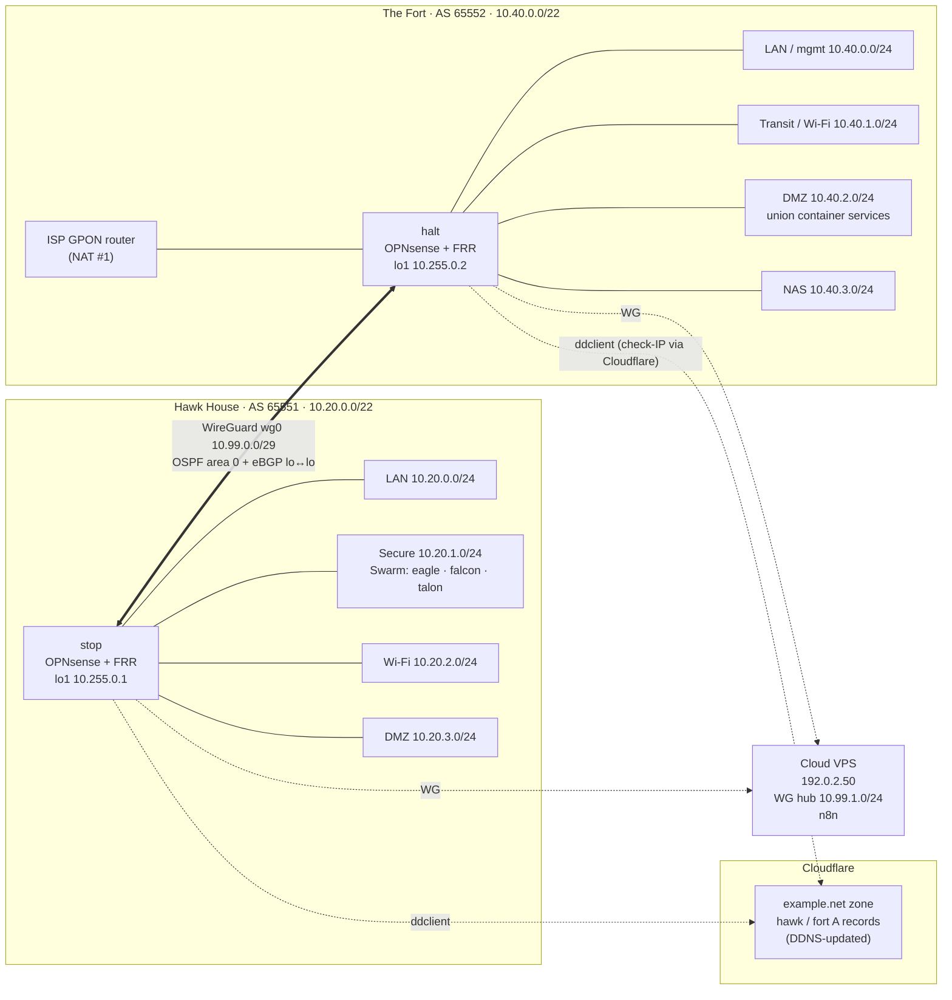
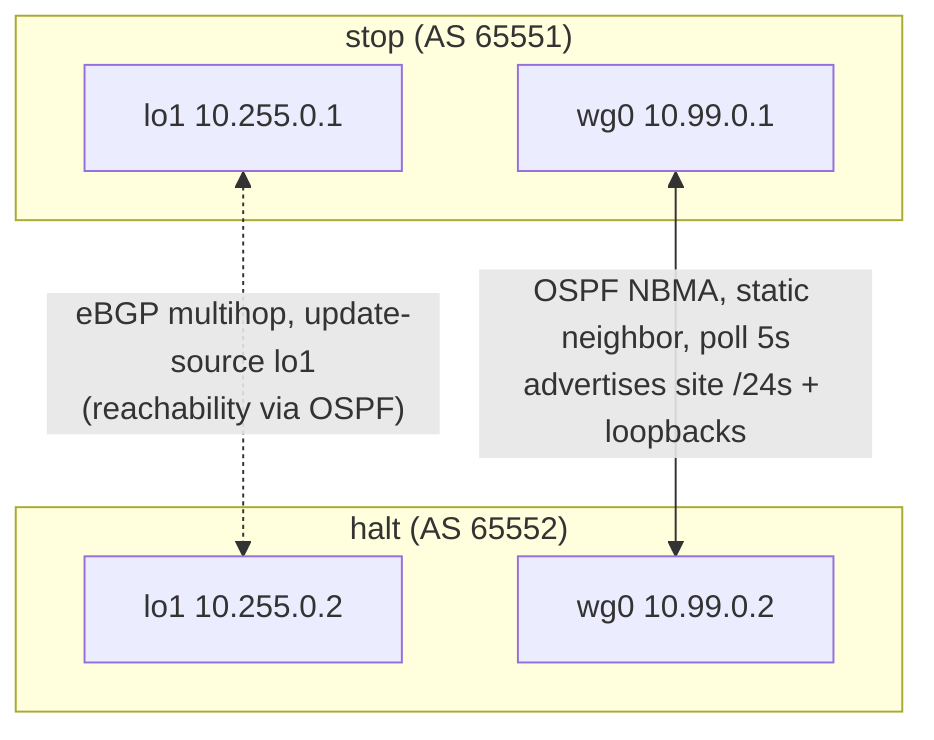
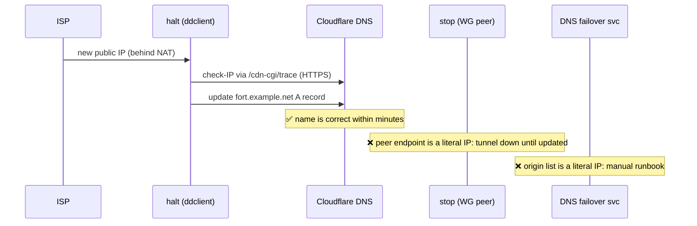

# Topology

## Logical: two sites, one tunnel, one cloud anchor

```mermaid
flowchart LR
  subgraph CF["Cloudflare"]
    DNS["example.net zone<br/>hawk / fort A records<br/>(DDNS-updated)"]
  end

  VPS["Cloud VPS<br/>192.0.2.50<br/>WG hub 10.99.1.0/24<br/>n8n"]

  subgraph HAWK["Hawk House · AS 65551 · 10.20.0.0/22"]
    STOP["stop<br/>OPNsense + FRR<br/>lo1 10.255.0.1"]
    H0["LAN 10.20.0.0/24"]
    H1["Secure 10.20.1.0/24<br/>Swarm: eagle · falcon · talon"]
    H2["Wi-Fi 10.20.2.0/24"]
    H3["DMZ 10.20.3.0/24"]
    STOP --- H0 & H1 & H2 & H3
  end

  subgraph FORT["The Fort · AS 65552 · 10.40.0.0/22"]
    ISP["ISP GPON router<br/>(NAT #1)"]
    HALT["halt<br/>OPNsense + FRR<br/>lo1 10.255.0.2"]
    F0["LAN / mgmt 10.40.0.0/24"]
    F1["Transit / Wi-Fi 10.40.1.0/24"]
    F2["DMZ 10.40.2.0/24<br/>union container services"]
    F3["NAS 10.40.3.0/24"]
    ISP --- HALT
    HALT --- F0 & F1 & F2 & F3
  end

  STOP <==>|"WireGuard wg0 10.99.0.0/29<br/>OSPF area 0 + eBGP lo↔lo"| HALT
  STOP -.->|WG| VPS
  HALT -.->|WG| VPS
  HALT -.->|"ddclient (check-IP via Cloudflare)"| DNS
  STOP -.->|ddclient| DNS
```

## Routing control plane

```mermaid
flowchart TB
  subgraph H["stop (AS 65551)"]
    HL["lo1 10.255.0.1"]
    HW["wg0 10.99.0.1"]
  end
  subgraph F["halt (AS 65552)"]
    FL["lo1 10.255.0.2"]
    FW["wg0 10.99.0.2"]
  end
  HW <-->|"OSPF NBMA, static neighbor, poll 5s<br/>advertises site /24s + loopbacks"| FW
  HL <-.->|"eBGP multihop, update-source lo1<br/>(reachability via OSPF)"| FL
```

## Fort WAN change: what follows automatically and what doesn't

```mermaid
sequenceDiagram
  participant ISP as ISP
  participant HALT as halt (ddclient)
  participant CF as Cloudflare DNS
  participant STOP as stop (WG peer)
  participant FO as DNS failover svc
  ISP->>HALT: new public IP (behind NAT)
  HALT->>CF: check-IP via /cdn-cgi/trace (HTTPS)
  HALT->>CF: update fort.example.net A record
  Note over CF: ✅ name is correct within minutes
  Note over STOP: ❌ peer endpoint is a literal IP: tunnel down until updated
  Note over FO: ❌ origin list is a literal IP: manual runbook
```
