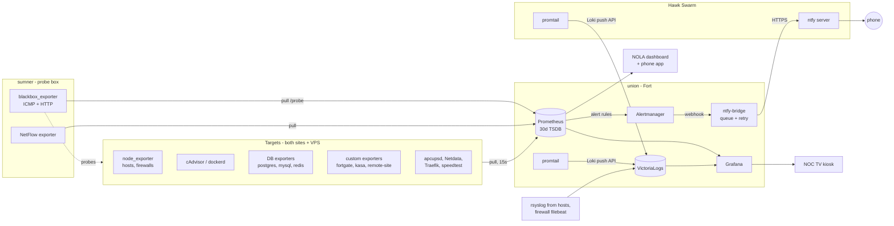

# Monitoring

One pull-based Prometheus watches both sites: every Linux host, both
firewalls, the Docker hosts and their containers, UPSes, databases, the ISP
fiber terminal, and a friend's remote network over WireGuard. Logs go to
VictoriaLogs, alerts go to my phone through a self-hosted ntfy server.

All addresses in this folder are sanitized (see
[`docs/SANITIZATION.md`](../docs/SANITIZATION.md)): Hawk = `10.20.0-3.x`,
Fort = `10.40.0-3.x`.

## Where things run

| Component | Host / site | How it runs |
|---|---|---|
| Prometheus (30-day TSDB) | union, Fort | single Docker container, macvlan IP `10.40.2.42` |
| Alertmanager | union, Fort | container, `10.40.2.68:9093` |
| ntfy-bridge (my Python service) | union, Fort | container, `10.40.2.69` |
| Grafana | union, Fort | container, `10.40.2.31`, behind Authentik SSO |
| VictoriaLogs + promtail | union, Fort | containers, `10.40.2.65` / `.53` |
| blackbox_exporter, NetFlow exporter | sumner, Fort | dedicated probe box `10.40.0.18` |
| second blackbox_exporter | knox (reverse proxy), Fort | for backends that only accept the proxy's IP |
| ntfy server | Hawk Docker Swarm | Swarm service, reached through Hawk's Traefik |
| LibreNMS (SNMP) | union, Fort | separate from Prometheus, polls the firewalls |

Honest caveat: the core stack is a **single host, not a cluster**. The Hawk
site runs a three-node Docker Swarm (eagle/falcon/talon), and it originally had
its own Prometheus/Grafana/Loki stack
([`swarm-retired/docker-stack.yml`](swarm-retired/docker-stack.yml)). In
August 2026 I consolidated onto the one Prometheus/Grafana on union and folded
Hawk's scrape jobs into it - two Grafanas with half the data each were worse
than one with all of it. The Swarm still hosts the alert *delivery* end (ntfy)
and is still scraped (node, cAdvisor, dockerd metrics).

## What gets scraped

At last count the live config had ~30 jobs and ~175 targets. A trimmed copy
with one example of each pattern is in
[`prometheus/prometheus.yml`](prometheus/prometheus.yml).

| Exporter | What it covers |
|---|---|
| node_exporter | Linux hosts at both sites, both NAS boxes, the cloud VPSes (over WireGuard), and the OPNsense firewalls (plugin) |
| Netdata (`/api/v1/allmetrics`) | unRAID and the two firewalls, scraped on their OSPF loopbacks |
| cAdvisor + dockerd metrics | per-container CPU/memory on every Docker host; engine metrics on the Swarm nodes |
| apcupsd_exporter | one UPS per site |
| postgres / mysqld / redis exporters | ~45 database and cache instances, using the multi-target `/probe` pattern (one exporter, many DBs) |
| blackbox ICMP | reachability of every host, labelled by `site` and `role` |
| blackbox HTTP | ~60 web backends, probed directly rather than through the proxy |
| speedtest-tracker | WAN up/down/latency at each site |
| Traefik / HAProxy | ingress metrics at both sites |
| **fortgate-exporter** (mine) | the ISP's fiber ONT has no SNMP, so this SSHes in and exposes interface counters |
| **kasa-exporter** (mine) | smart plugs over their local protocol - built and scraping; waiting on metering-capable plugs for real power data |
| **remote-site exporter** (mine) | a friend's OPNsense via its API: DHCP leases, ARP, gateway loss, WireGuard handshake age |
| **NetFlow exporter** | flow data on the probe box, labelled by source/destination site |
| textfile collectors (mine) | ZFS pool state on the NAS boxes - node_exporter doesn't expose it |

There is no `snmp_exporter`; SNMP polling of network gear is done by LibreNMS,
which runs alongside rather than feeding Prometheus. All targets are static -
no file_sd or Swarm service discovery.

## Pipeline

## Alerting

Prometheus evaluates rules every 15 s. Alertmanager is deliberately minimal:
one route, one receiver, grouped by `alertname` + `instance` (30 s group wait,
3 h repeat), so a host falling over produces one notification rather than one
per exporter.

The receiver is **ntfy-bridge**, a small Python service I wrote that converts
Alertmanager's webhook JSON into ntfy messages. Its first version posted inline
and swallowed failures, which lost alerts during an outage. The rewrite:

- acknowledges Alertmanager in ~2 ms and puts the alert on a bounded queue;
- a single worker sends at a fixed pace and retries up to 6 times, honouring
  `Retry-After` on HTTP 429;
- logs `ALERT LOST` loudly instead of dropping silently;
- drains the queue on SIGTERM so a restart doesn't lose anything in flight.

The ntfy server runs at the *other* site, so a Fort-side failure still has a
delivery path off-site. The bridge is exempted from ntfy's rate limit by
source IP, verified with a burst test (100/100 accepted vs. 66/100 from an
unexempted host).

Separately, Grafana-managed rules watch Prometheus *itself* - a stopped
Prometheus can't fire `up == 0` about itself, and that gap once cost nine
days of silent outage. Log-based alerts run through a second, smaller stack
(vmalert against VictoriaLogs).

A curated set of the real rules is in
[`prometheus/alert.rules.yml`](prometheus/alert.rules.yml). Highlights:

- **Disk** alerts need *both* a low percentage *and* low absolute bytes, so a
  2 TB disk at 12 % (200 GB free) doesn't page.
- **UPS** rules are gated on the exporter reporting non-zero nominal power,
  with a separate `UPSNotReporting` rule for the "exporter up, UPS link dead"
  case.
- **FortgateWANDropRatio** alerts on a drop *ratio* with a minimum-traffic
  floor, because the ONT drops a constant ~0.34 pkt/s no matter the load.
- **ZpoolQueryStuck** treats a hung `zpool` command as the signal - a
  suspended pool blocks the query rather than reporting a bad state.
- **Remote-site** rules alert on wifi *flapping* and lease-held-but-ARP-cold
  (silent deauth), not latency, because the battery cameras there baseline at
  260-920 ms.

## Logs

promtail on union discovers every container via the Docker socket and also
ships `/var/log/syslog` and `auth.log`. A promtail on the Hawk Swarm, host
syslog (rsyslog/syslog-ng) and the Fort firewall's filebeat feed the same
VictoriaLogs instance. VictoriaLogs accepts Loki's push API, so promtail
needed no changes when I replaced Loki. Grafana queries it with the
VictoriaLogs plugin (LogsQL).

## Design decisions

- **Pull, from one place.** One Prometheus that can route to both sites over
  the WireGuard/OSPF core. A target Prometheus can't route to is invisible,
  which makes reachability problems obvious instead of silent.
- **Probe from a separate box.** blackbox_exporter runs on sumner, not on the
  Prometheus host, so "is it up" is measured from a normal LAN vantage point.
  A second probe on the proxy host covers backends firewalled to the proxy only.
- **Every container gets a macvlan IP.** Services are addressable directly
  from both sites. The catch: a macvlan container cannot reach its own Docker
  host, so union's own node_exporter and cAdvisor run as sibling containers
  with their own IPs.
- **Write the exporter when there isn't one.** The ISP terminal, smart plugs
  and the remote firewall's API had nothing off the shelf; small exporters
  made them first-class Prometheus targets instead of separate tools.
- **Comment the "why" in the rules.** Most rules carry the incident or
  measurement that set their threshold, so the next change is informed.
- **Consolidate rather than federate.** At this scale one Prometheus is
  simpler to reason about than a per-site pair; the trade-off is a single
  point of failure, covered by the Grafana watchdog and off-site ntfy.

### Known gaps

- Images are on `:latest`; pinning at least Prometheus is on the list.
- 30-day local retention, no long-term or remote-write store.
- The core stack is one host; if union is down, so is collection (alert
  delivery still lives at Hawk).

## Files

| File | What it is |
|---|---|
| [`prometheus/prometheus.yml`](prometheus/prometheus.yml) | trimmed live scrape config - one example of each pattern |
| [`prometheus/alert.rules.yml`](prometheus/alert.rules.yml) | curated live alert rules with their original comments |
| [`docker-compose.yml`](docker-compose.yml) | Prometheus, Grafana and VictoriaLogs as deployed on union |
| [`swarm-retired/docker-stack.yml`](swarm-retired/docker-stack.yml) | the retired Hawk Swarm monitoring stack |
