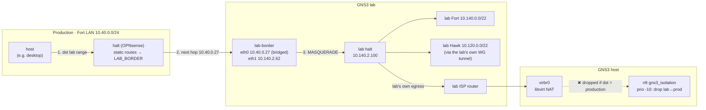

# Routed access into an isolated GNS3 lab

I run a GNS3 replica of both sites: OPNsense firewalls, the WireGuard tunnel,
the monitoring stack. It's where I try BGP designs and rehearse failures. I
wanted to reach it **directly from production** (ping, SSH, traceroute, browser)
**without the lab joining production's routing**, and without giving a lab
that I deliberately plant vulnerabilities in any path back.

Addresses are sanitized: production Fort `10.40.0.0/22`, Hawk `10.20.0.0/22`;
lab Fort `10.140.0.0/22`, lab Hawk `10.120.0.0/22`. See
[docs/SANITIZATION.md](../../docs/SANITIZATION.md).

## Design



| Piece | What it does |
|---|---|
| **lab-border** ([`lab-border/`](lab-border/)) | A small container inside the lab with one leg **bridged onto the real Fort LAN** (GNS3 Cloud node on the host NIC, so no host routing changes are needed) and one leg in the lab DMZ. It routes the lab ranges toward lab halt, **NATs everything it forwards**, and is default-deny in the other direction. |
| **halt static routes** | Gateway `LAB_BORDER` = `10.40.0.27` (gateway monitoring off, so a stopped lab doesn't raise alarms). Routes: lab Fort `/22`, lab Hawk `/23` + `/24`. |
| **"Bypass firewall rules for traffic on the same interface"** (OPNsense → Firewall → Advanced) | Hosts on the Fort LAN share a subnet with lab-border. Their packets go host → halt → lab-border, but replies come straight back from lab-border on layer 2, so halt only sees one direction and would drop the flow as invalid. This setting exempts static-route traffic that enters and leaves on the same interface. |
| **Host isolation rule** ([`isolation/`](isolation/)) | An nftables table on the GNS3 host that drops *new* connections from the lab's NAT bridge into production. Lab → internet still works. |

### Why NAT at lab-border instead of routes both ways

With NAT, the lab sees every production client as `10.140.2.62`. That means:
- **No routes back.** The lab's firewalls need no knowledge of production, so
  lab configs stay a faithful mirror and can be rebuilt freely.
- **No routing protocol crosses the boundary.** Lab BGP/OSPF experiments can't
  leak into production, and production prefixes can't leak into the lab.
- **One-way by construction.** The only `NEW` state lab-border accepts is
  production → lab.

### Why the lab Hawk route is `/23 + /24`, not `/22`

In the real address plan, the lab ranges were picked to mirror production's
last two octets, and two of production's own ranges fall inside them: the
**router loopbacks** sit inside the lab-Hawk `/22`, and **halt's real WAN
segment** (the ISP router LAN) has the same subnet as the lab's simulated ISP.
A summary `/22` would have pulled the loopbacks toward the lab (only the /32s'
longest-prefix match was hiding it), and a route for the ISP segment would cut
halt off from the internet. So the routes skip those subnets explicitly, and
there's a comment in the code saying why.

## Finding: the lab already had a way out

After lab-border was up, I tested the negative case: can the lab reach
production? Through lab-border, no: a forced route was dropped by its
default-deny policy. But a plain ping from a lab container to a production
desktop **succeeded** anyway, through a path that had existed all along:

```
ttl=1  lab halt
ttl=2  lab ISP router
ttl=3  GNS3 host virbr0      ← libvirt NAT
ttl=4  production desktop    ← reached
```

The lab's simulated internet uplink is libvirt's NAT network, which happily
forwards to anything the host can reach, including production.

**First fix attempt failed, and why.** A `DROP` in Docker's `DOCKER-USER`
chain never matched:

```
-P FORWARD DROP
-A FORWARD -j LIBVIRT_FWX
-A FORWARD -j LIBVIRT_FWI
-A FORWARD -j LIBVIRT_FWO     ← ACCEPTs the lab's NAT subnet from virbr0
...                           ← DOCKER-USER is reached only after these
```

libvirt inserts its jumps at the **top** of `FORWARD` and accepts the lab's
traffic before Docker's chain is consulted. And both libvirt and Docker re-insert
their rules on restart, so any iptables rule ordering is temporary.

**What worked:** a separate nftables table hooked at **priority −10**, which
runs before the iptables-nft filter chains (priority 0). In nftables a drop in
*any* base chain is final, so neither libvirt nor Docker can override it, no
matter how they reorder their own rules. It's loaded by a oneshot systemd unit
ordered before both services.

## Verification

| Test | Expected | Result |
|---|---|---|
| Fort LAN host → lab Fort / lab Hawk | reachable | ✅ ~1 ms / ~1.7 ms |
| Host on another Fort subnet → lab | reachable | ✅ |
| `tracepath` desktop → lab service | halt → lab-border → target | ✅ 3 hops |
| Lab node forced via lab-border → production | dropped | ✅ `policy DROP 3 packets` |
| Lab node → production via the lab ISP | dropped | ✅ (reached *before* the nft fix) |
| Lab node → internet | still works | ✅ |
| Published lab services (reverse proxy → host relay → lab) | unaffected | ✅ |

## Lessons

- **Test the negative case.** The one-way door worked as designed; the leak was
  somewhere I hadn't been asked to look.
- **Rule order belongs to whoever inserted last.** On a host running libvirt
  and Docker, don't fight over iptables `FORWARD` ordering; hook earlier in
  nftables.
- **Overlapping address plans need explicit exclusions,** written down where the
  next person will see them.
- **Same-subnet static-route next hops cause asymmetric flows.** Plan for the
  firewall's state tracking, not just the routing table.
