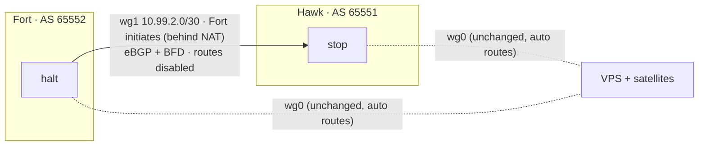

# Runbook: make BGP carry inter-site traffic

**Goal:** inter-site forwarding is decided by eBGP, not by WireGuard's
auto-installed routes. **Platform:** OPNsense + `os-frr` 1.55 (FRR 10.7) on both
edges. **Status:** planned, not yet executed.

Addresses are sanitized ([docs/SANITIZATION.md](../../docs/SANITIZATION.md)).
New values introduced by this runbook:

| Item | Value |
|---|---|
| New site-to-site WireGuard instance | `wg1`, UDP **51830** on Hawk |
| New transit /30 | `10.99.2.0/30`: Hawk `.1`, Fort `.2` |
| BGP | Hawk AS 65551 ↔ Fort AS 65552, single-hop eBGP on the `wg1` addresses, BFD on |

## Why it's built this way

**Today:** the WireGuard peer on `wg0` lists each far-site /24 in `AllowedIPs`,
and OPNsense installs a kernel route for each one (distance 0). Those routes beat
every protocol, so OSPF and BGP routes are learned but never installed. See
[bgp-fix-2026-10.md](../bgp-fix-2026-10.md).

**Fix:** WireGuard's *Disable routes* option stops that. But it is per
**instance**, and `wg0` also carries the cloud VPS and satellite peers, which rely
on those auto routes. So the site-to-site link moves to its own instance, `wg1`,
with routes disabled, and BGP runs across it. `wg0` keeps serving everything else
unchanged.

**Target design:**



### Design decisions

| Decision | Reason |
|---|---|
| Single-hop eBGP on the tunnel addresses, not loopback multihop | The /30 is directly connected, so the session needs no other route to come up. No IGP is needed to bootstrap it. This is the design cloud VPNs use (AWS/Azure BGP over IPsec). |
| BFD on the neighbor | A dead tunnel is detected in ~1 s instead of BGP's 90 s hold time. |
| **Fort initiates; Hawk's peer entry has no endpoint** | Fort is double-NATed and its IP is dynamic. Hawk has a stable public IP, so it listens and learns Fort's address from the handshake. Fort's IP no longer has to be recorded anywhere, which fixes the "literal IP in the peer" issue. |
| Plain prefix-lists, no route-maps, on the new neighbor | A smaller surface. The old OSPF/BGP name collision came from route-maps and prefix-lists shared across pages, so the new objects get unique `BGP-` names. |
| OSPF switched off at the end | One link plus BGP needs no IGP. Two protocols carrying the same prefixes is just more to debug. |
| **Change the remote site (Hawk) before the local one (Fort)** | See Phase 3: the cutover has a short one-way window, so change the site you can only reach through the tunnel while the tunnel still works. |

## Phase 0: preconditions (do not skip)

| # | Check | Pass condition |
|---|---|---|
| 0.1 | **Out-of-band path to the Hawk firewall** (e.g. the zero-trust connector on the Hawk Swarm) reaches its GUI **with the inter-site tunnel ignored** | GUI login works from that path. **If this fails, stop here.** |
| 0.2 | Config backup on both: *System → Configuration → Backups → Download*, plus `cp /conf/config.xml /conf/config.xml.pre-bgp-cutover` | Files exist |
| 0.3 | The prefix-list name collision is cleaned up (rename the OSPF-page prefix-lists, e.g. `OSPF-…`, as was done for the route-maps) | `show ip prefix-list` shows no name defined by both pages |
| 0.4 | Baseline captured on both (commands below), saved to a file | Saved |
| 0.5 | Dead-man switch **dry run on the Fort firewall** (local and safe): arm it, change something harmless (a neighbor description), let it fire | The description reverts by itself |
| 0.6 | Maintenance window agreed; nobody depending on cross-site services | ✓ |

Baseline / verification commands, used throughout:

```sh
vtysh -c 'show bgp summary'
vtysh -c 'show bfd peers brief'
vtysh -c 'show ip route 10.20.0.0/22 longer-prefixes'   # on Fort (use 10.40.0.0/22 on Hawk)
wg show wg1 latest-handshakes
ping -c3 -S 10.40.0.100 10.20.0.100                     # LAN-to-LAN, from Fort
```

### The dead-man switch

OPNsense has no `commit confirmed`, so build one. Run this over SSH **on the
firewall being changed, before applying the change**. It restores the backup
and reapplies everything in 15 minutes unless it's cancelled. The root shell is
csh, which rejects multi-line quoted commands, so start `sh` first:

```sh
sh
cp /conf/config.xml /conf/config.xml.pre-cutover
daemon -f -p /var/run/deadman.pid sh -c 'sleep 900; \
  cp /conf/config.xml.pre-cutover /conf/config.xml; \
  configctl wireguard restart; \
  /usr/local/opnsense/scripts/frr/setup.sh; configctl quagga restart; \
  configctl filter reload'
```

Cancel it once everything has been verified (from `sh`): `kill $(cat /var/run/deadman.pid)`.
Check that it's armed with `pgrep -lf 'sleep 900'`.

`setup.sh` regenerates `frr.conf` from `config.xml`, so the restart loads the
restored config, not the edited file.

## Phase 1: build `wg1` alongside `wg0` (no traffic change)

**Hawk (stop) first, then Fort.** On each:

1. **VPN → WireGuard → Instances → +**
   - Name `wg1-site`, generate keys, **Listen port** `51830` (Hawk; leave Fort's empty or set it to the same)
   - **Tunnel address** `10.99.2.1/30` (Hawk) / `10.99.2.2/30` (Fort)
   - **Disable routes: ✔** (the point of this whole runbook)
   - MTU `1420`
2. **VPN → WireGuard → Peers → +**
   - On Hawk, peer `fort-wg1`: Fort's `wg1` public key; **Allowed IPs** `10.99.2.2/32, 10.40.0.0/22, 10.255.0.2/32`; **no endpoint**
   - On Fort, peer `hawk-wg1`: Hawk's `wg1` public key; **Allowed IPs** `10.99.2.1/32, 10.20.0.0/22, 10.255.0.1/32`; **Endpoint** `hawk.example.net` port `51830`; **Keepalive** `25`
   - The same prefixes are already in `wg0`'s allowed list. That's fine: allowed lists are per instance.
3. **Interfaces → Assignments**: assign `wg1`, enable it, IPv4 config **None** (WireGuard sets the address), description `WG1_SITE`.
4. **Firewall rules**
   - Hawk **WAN**: pass UDP → *This Firewall* port 51830 (source any; Fort's IP is dynamic).
   - **`WG1_SITE` interface, both sides:** copy the inter-site rules that exist today on the `wg0` interface, then add a pass rule for TCP 179 (BGP) and UDP 3784–3785 (BFD) from the peer's `/32`.
   - No NAT rules are needed: Fort initiates outbound, and the existing outbound NAT applies to WAN only.

**Verify:** `wg show wg1 latest-handshakes` updates; `ping 10.99.2.1` from Fort
works. Routing tables are unchanged: `K>*` is still selected for the far
site's /24s.

**Roll back:** disable the `wg1` instance.

## Phase 2: bring BGP up on `wg1`, then retire the old control plane (no traffic change)

All of this is invisible to forwarding, because the `K` routes still win.
**After each step, confirm the far site's /24s are still `K>*`.**

1. **Routing → BGP → Prefix Lists**: create, with unique names:
   - Fort: `BGP-FORT-OUT` = `10.40.0.0/22 ge 24 le 24` + `10.255.0.2/32`; `BGP-HAWK-IN` = `10.20.0.0/22 ge 24 le 24` + `10.255.0.1/32`
   - Hawk: the mirror image (`BGP-HAWK-OUT`, `BGP-FORT-IN`)
2. **Routing → BGP → Neighbors → +**: Peer IP = far `wg1` address, Remote AS =
   far AS, **BFD ✔**, Prefix-List In/Out as above. Leave multihop and
   update-source empty.
3. **Routing → BFD**: enable, add neighbor = far `wg1` address.
4. Verify: `show bgp summary` shows the new neighbor Established, **PfxRcd 5 /
   PfxSnt 5** (four /24s plus the loopback); `show bfd peers brief` shows `up`.
5. **Disable the old loopback neighbor** (uncheck *Enabled* on the
   `10.255.0.x` neighbor). That leaves one BGP path per prefix, so best-path
   selection can't pick the old session.
6. **Routing → OSPF**: uncheck *Enable*. (OSPF routes were never installed, so
   nothing moves.)
7. **Routing → BGP → General**: clear the *Distance* field (back to the eBGP
   default of 20).

**Roll back:** re-enable the old neighbor and OSPF, set the distance back to 200,
disable the new neighbor.

## Phase 3: cutover (the only step that moves traffic)

Taking the far-site /24s out of `wg0`'s allowed list removes the `K` routes, and
the BGP routes over `wg1` take over.

**Why there is a window, and why the order matters.** Removing a prefix from a
WireGuard peer's allowed list also makes that instance **drop incoming packets
from that prefix**. Between the two edits, traffic is one-way: the changed side
sends over `wg1`, but the replies come back over the other side's `wg0` and are
dropped. Expect inter-site traffic to stop for the minute or two between steps
3.3 and 3.4. **Do the remote site first**: once the change on Hawk applies, your
GUI session to it drops, but the change is already in. Fort is local, so you can
finish without needing the tunnel.

| Step | Where | Action |
|---|---|---|
| 3.1 | Hawk (SSH) | **Arm the dead-man switch** (above) |
| 3.2 | Fort (SSH) | `cp /conf/config.xml /conf/config.xml.pre-cutover` |
| 3.3 | **Hawk GUI** | *Peers* → the `wg0` peer for Fort → remove `10.40.0.0/24`…`10.40.3.0/24` and `10.255.0.2/32` from Allowed IPs, keeping the transit `/32` and any satellite `/32`s → Save → Apply. *Expect the GUI session to drop.* |
| 3.4 | **Fort GUI (local)** | The same on the `wg0` peer for Hawk: remove the four `10.20.x.0/24`s and `10.255.0.1/32` → Apply |
| 3.5 | Fort | Verify (below) |
| 3.6 | Hawk (now reachable through `wg1`) | Verify, then **cancel the dead-man switch** |

**Verify, on both sides:**

```
show ip route 10.20.1.0/24          (on Fort)
B>* 10.20.1.0/24 [20/0] via 10.99.2.1, wg1      ← BGP selected and installed
```

Then: LAN-to-LAN ping both ways, a `traceroute` that goes through `wg1`,
cross-site services (monitoring scrapes on the other site, DNS failover health
checks), and no new `K` routes for site prefixes (`show ip route summary`).

**Roll back:**
- **Fort:** re-add the prefixes to its `wg0` peer (local, instant).
- **Hawk:** re-add over the tunnel, or let the dead-man switch fire.
- **If the dead-man fires on Hawk after Fort is already done,** roll Fort back
  too. Otherwise the one-way problem returns in the other direction.

## Phase 4: cleanup and documentation

- Remove the old loopback neighbor and the OSPF config once a week of stable
  running has passed (keep them disabled until then as a fast rollback).
- Delete the DNS-failover origin and peer-endpoint entries that held Fort's literal
  WAN address and are now redundant.
- Update `networking/README.md`, the diagrams and `frr/*.conf` in this repo;
  re-run `scripts/sanitize-check.sh`.

## Phase 5 (optional): a second path, where BGP really pays off

`wg0` can't be the backup path: it would need the site prefixes back in its
allowed list, and the auto routes would win again. Redundancy needs a **second
routes-disabled instance** (`wg2`, its own /30 and port):

- **Inbound:** route-map on the `wg1` neighbor with `set local-preference 200`
  (`wg2` stays at the default 100), so each side *sends* via `wg1`.
- **Outbound:** route-map on the `wg2` neighbor with `set as-path prepend <own AS> <own AS>`,
  so the far side also prefers `wg1` for traffic coming *back*.
- **Test:** disable `wg1` → BFD drops the session in about a second → traffic
  moves to `wg2`. Re-enable it → traffic returns.

Both tunnels ride the same ISP links, so this protects against tunnel, key
or process failure, not an ISP outage. Real path diversity needs a second WAN
(e.g. LTE) at one site, and the same BGP policy then covers it.
